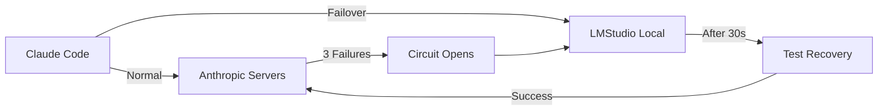

# Emergency Failover to LMStudio

This guide explains how to set up and use the automatic failover system that routes requests to a local LMStudio instance when Anthropic's servers are unavailable.

## Quick Start

### 1. Install and Run LMStudio

```bash
# Download from https://lmstudio.ai
# Open LMStudio, download a model, and start the server
```

### 2. Run anyclaude Normally

```bash
bun run src/main.ts
```

That's it! The failover system is **enabled by default** and will automatically activate if Claude's servers go down.

## How It Works



### State Transitions

1. **CLOSED** (Normal)
   - All requests go to Anthropic
   - Circuit monitors for failures

2. **OPEN** (Failover Active)
   - After 3 consecutive failures
   - All requests route to LMStudio
   - Waits 30 seconds before testing recovery

3. **HALF_OPEN** (Testing Recovery)
   - Sends test request to Anthropic
   - If success → back to CLOSED
   - If failure → back to OPEN

## Configuration

### Environment Variables

```bash
# LMStudio connection (defaults work for standard setup)
export LMSTUDIO_URL=http://localhost:1234/v1
export LMSTUDIO_MODEL=local-model
export LMSTUDIO_API_KEY=lm-studio

# Failover behavior
export FAILOVER_ENABLED=true              # Enable/disable failover
export FORCE_LMSTUDIO=false               # Force all requests to LMStudio
export CIRCUIT_FAILURE_THRESHOLD=3        # Failures before opening circuit
export REQUEST_TIMEOUT=5000               # Request timeout (ms)
export HEALTH_CHECK_INTERVAL=30000        # Health check interval (ms)
```

### Testing Failover

Test without waiting for an actual outage:

```bash
# Method 1: Force LMStudio mode
FORCE_LMSTUDIO=true bun run src/main.ts

# Method 2: Simulate failures (requires code modification)
# Set very low timeout to trigger circuit breaker
REQUEST_TIMEOUT=1 bun run src/main.ts
```

## Monitoring

The system provides real-time status logging:

```
[Failover] Emergency failover system enabled
[Failover] LMStudio endpoint: http://localhost:1234/v1
[Failover] Default model: local-model
```

### Failover Events

**Circuit Opens** (Failover activated):

```
[Failover] ⚠️  Circuit OPEN - Anthropic servers appear to be down
[Failover] 🔄 Failing over to LMStudio at http://localhost:1234/v1
```

**Testing Recovery**:

```
[Failover] 🔍 Circuit HALF_OPEN - Testing Anthropic recovery...
```

**Recovery Complete**:

```
[Failover] ✅ Circuit CLOSED - Anthropic servers recovered, back to normal
```

## Troubleshooting

### Failover Not Working

**Problem**: LMStudio not receiving requests during outage

**Check**:

1. Is LMStudio server running?

   ```bash
   curl http://localhost:1234/v1/models
   ```

2. Is failover enabled?

   ```bash
   echo $FAILOVER_ENABLED  # Should be empty or "true"
   ```

3. Check circuit state in logs:
   ```
   [Failover] Emergency failover system enabled  # Must see this on startup
   ```

### LMStudio Connection Errors

**Problem**: "LMStudio fallback not configured" error

**Solution**:

```bash
# Ensure LMStudio server is running on correct port
export LMSTUDIO_URL=http://localhost:1234/v1

# Test connection
curl $LMSTUDIO_URL/v1/models
```

### Circuit Won't Close

**Problem**: Stuck in OPEN state even after Anthropic recovers

**Solution**:

- Wait for next health check (default: 30 seconds)
- Or restart anyclaude to reset circuit breaker

### Premature Failover

**Problem**: Circuit opens too quickly during temporary issues

**Solution**:

```bash
# Increase failure threshold
export CIRCUIT_FAILURE_THRESHOLD=5

# Increase timeout
export REQUEST_TIMEOUT=10000
```

## Best Practices

### 1. Always Run LMStudio in Background

Keep LMStudio running with a model loaded:

- Uses minimal resources when idle
- Instant failover when needed
- No "cold start" delays

### 2. Choose an Appropriate Local Model

Recommendations:

- **Fast responses**: Mistral 7B, Llama 3.2 8B
- **Better quality**: DeepSeek Coder 33B, Llama 3.1 70B
- **Resource constrained**: Phi-3 Mini, TinyLlama

### 3. Test Periodically

```bash
# Monthly failover drill
FORCE_LMSTUDIO=true bun run src/main.ts
# Use Claude Code normally and verify it works
```

### 4. Monitor Logs

Watch for failover events:

```bash
# Run with debug logging
ANYCLAUDE_DEBUG=1 bun run src/main.ts | grep Failover
```

## Architecture

### Circuit Breaker Pattern

Based on industry-standard resilience patterns from AWS, Netflix, and Microsoft:

- **Fast Failure Detection**: 5-second timeout per request
- **Automatic Recovery**: Tests every 30 seconds
- **Gradual Return**: HALF_OPEN state prevents flapping
- **Transparent Routing**: Claude Code doesn't know about failover

### Implementation Files

- `src/circuit-breaker.ts` - State machine (CLOSED/OPEN/HALF_OPEN)
- `src/health-check.ts` - Periodic health monitoring
- `src/failover-manager.ts` - Coordination and configuration
- `src/anthropic-proxy.ts` - Request routing integration

### Design Principles

1. **Fail Fast**: Detect issues within seconds, not minutes
2. **Fail Safe**: Always have a working backup (LMStudio)
3. **Recover Automatically**: No manual intervention required
4. **Monitor Everything**: Clear logging for debugging

## Advanced Usage

### Custom Circuit Breaker Behavior

For specific use cases, adjust thresholds:

```bash
# High reliability (slower to fail over)
export CIRCUIT_FAILURE_THRESHOLD=5
export REQUEST_TIMEOUT=10000

# High availability (faster failover)
export CIRCUIT_FAILURE_THRESHOLD=2
export REQUEST_TIMEOUT=3000

# Aggressive health checks
export HEALTH_CHECK_INTERVAL=15000
```

### Disabling Failover

Not recommended, but possible:

```bash
export FAILOVER_ENABLED=false
```

### Custom LMStudio Model

If you have a specific model loaded:

```bash
# Check loaded model name in LMStudio
export LMSTUDIO_MODEL=mistral-7b-instruct

# Or use full path if needed
export LMSTUDIO_MODEL=mistralai/mistral-7b-instruct-v0.3
```

## FAQ

**Q: Does this work with Ollama instead of LMStudio?**
A: Not currently, but it's easy to add. Ollama uses the same OpenAI-compatible API format. Just modify `failover-manager.ts` to use Ollama's endpoint.

**Q: Will my Claude Code Max subscription still work?**
A: Yes! This only activates during emergencies. Normal operation uses your Max subscription with all its features.

**Q: Does LMStudio need internet?**
A: No - that's the point! LMStudio runs entirely offline, making it perfect for emergency backup.

**Q: How much disk space does LMStudio need?**
A: Depends on model size:

- Small models (7B): 4-8 GB
- Medium models (13-33B): 8-20 GB
- Large models (70B+): 40+ GB

**Q: Can I use multiple local models?**
A: Not currently - the failover uses a single configured model. You could modify `failover-manager.ts` to support model selection.

**Q: What happens to tool calling during failover?**
A: It depends on your local model's capabilities. Most modern models support tool calling, but responses may differ from Claude.

## Support

For issues or questions:

1. Check logs for failover status
2. Test LMStudio connection directly
3. Review configuration with `env | grep LMSTUDIO`
4. Open issue at https://github.com/coder/anyclaude/issues
